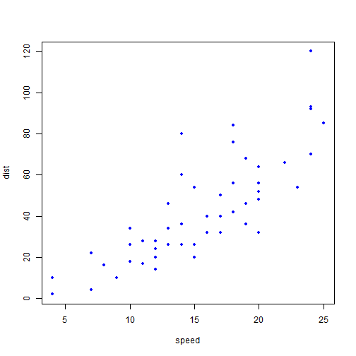

## Read-And-Delete

> 1. Introduction
> 2. how to write an equation
> 3. Plot in R
> 4. Conclusion

--- 

## Writting an Equations in R

# $ CMR = \hat{ \alpha } +  \ \hat{ \beta}PGNP +  \ \hat{ \gamma }  FLR + \ \hat{ \epsilon } $
where : CMR = Child Mortality Rate
        PGNP = per capita GNP
        FMR = Female Literacy Rate

---


```r
plot(cars, pch = 20, col = "blue")
```

 

---
## Code with output


```r
summary(cars)
```

```
##      speed           dist       
##  Min.   : 4.0   Min.   :  2.00  
##  1st Qu.:12.0   1st Qu.: 26.00  
##  Median :15.0   Median : 36.00  
##  Mean   :15.4   Mean   : 42.98  
##  3rd Qu.:19.0   3rd Qu.: 56.00  
##  Max.   :25.0   Max.   :120.00
```

---
## code without the output

```r
summary(cars)
```

---


## How to read data in slidify

```r
setwd("C:/Users/agohil/Book")
data = read.csv("final.csv" , sep = ",", header = TRUE)
head(data)
```

```
##   Income Consumption
## 1    200         130
## 2    450         300
## 3    200          50
## 4    300         220
## 5    600         450
## 6    550         140
```

---
## Including a table in your slide

```r
knitr::kable(data)
```


| Income| Consumption|
|------:|-----------:|
|    200|         130|
|    450|         300|
|    200|          50|
|    300|         220|
|    600|         450|
|    550|         140|
|    150|          80|

---
## embedding an image in presentation

image: 

---

```r
library(googleVis)
```

```
## Warning: package 'googleVis' was built under R version 3.1.2
```

```r
op <- options(gvis.plot.tag='chart')
```

---


```r
## Add the mean
CityPopularity$Mean=mean(CityPopularity$Popularity)
CC <- gvisComboChart(CityPopularity, xvar='City',
          yvar=c('Mean', 'Popularity'),
          options=list(seriesType='bars',
                       width=450, height=300,
                       title='City Popularity',
                       series='{0: {type:\"line\"}}'))
plot(CC)
```

<!-- ComboChart generated in R 3.1.1 by googleVis 0.5.6 package -->
<!-- Tue Nov 11 09:30:41 2014 -->


<!-- jsHeader -->
<script type="text/javascript">
 
// jsData 
function gvisDataComboChartID16f035381ccd () {
var data = new google.visualization.DataTable();
var datajson =
[
 [
 "New York",
450,
200 
],
[
 "Boston",
450,
300 
],
[
 "Miami",
450,
400 
],
[
 "Chicago",
450,
500 
],
[
 "Los Angeles",
450,
600 
],
[
 "Houston",
450,
700 
] 
];
data.addColumn('string','City');
data.addColumn('number','Mean');
data.addColumn('number','Popularity');
data.addRows(datajson);
return(data);
}
 
// jsDrawChart
function drawChartComboChartID16f035381ccd() {
var data = gvisDataComboChartID16f035381ccd();
var options = {};
options["allowHtml"] = true;
options["seriesType"] = "bars";
options["width"] =    450;
options["height"] =    300;
options["title"] = "City Popularity";
options["series"] = {0: {type:"line"}};

    var chart = new google.visualization.ComboChart(
    document.getElementById('ComboChartID16f035381ccd')
    );
    chart.draw(data,options);
    

}
  
 
// jsDisplayChart
(function() {
var pkgs = window.__gvisPackages = window.__gvisPackages || [];
var callbacks = window.__gvisCallbacks = window.__gvisCallbacks || [];
var chartid = "corechart";
  
// Manually see if chartid is in pkgs (not all browsers support Array.indexOf)
var i, newPackage = true;
for (i = 0; newPackage && i < pkgs.length; i++) {
if (pkgs[i] === chartid)
newPackage = false;
}
if (newPackage)
  pkgs.push(chartid);
  
// Add the drawChart function to the global list of callbacks
callbacks.push(drawChartComboChartID16f035381ccd);
})();
function displayChartComboChartID16f035381ccd() {
  var pkgs = window.__gvisPackages = window.__gvisPackages || [];
  var callbacks = window.__gvisCallbacks = window.__gvisCallbacks || [];
  window.clearTimeout(window.__gvisLoad);
  // The timeout is set to 100 because otherwise the container div we are
  // targeting might not be part of the document yet
  window.__gvisLoad = setTimeout(function() {
  var pkgCount = pkgs.length;
  google.load("visualization", "1", { packages:pkgs, callback: function() {
  if (pkgCount != pkgs.length) {
  // Race condition where another setTimeout call snuck in after us; if
  // that call added a package, we must not shift its callback
  return;
}
while (callbacks.length > 0)
callbacks.shift()();
} });
}, 100);
}
 
// jsFooter
</script>
 
<!-- jsChart -->  
<script type="text/javascript" src="https://www.google.com/jsapi?callback=displayChartComboChartID16f035381ccd"></script>
 
<!-- divChart -->
  
<div id="ComboChartID16f035381ccd" 
  style="width: 450; height: 300;">
</div>

---

